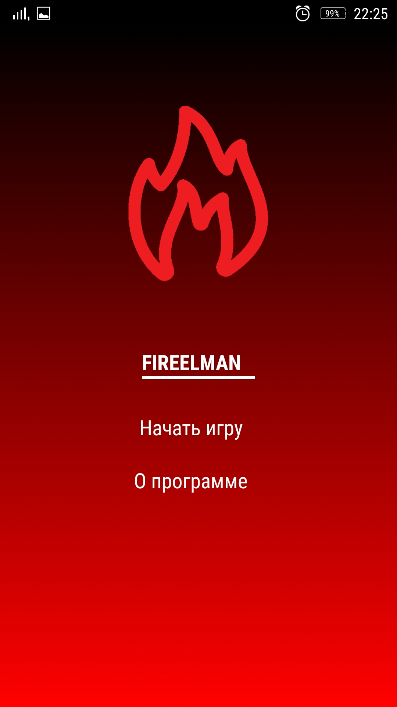
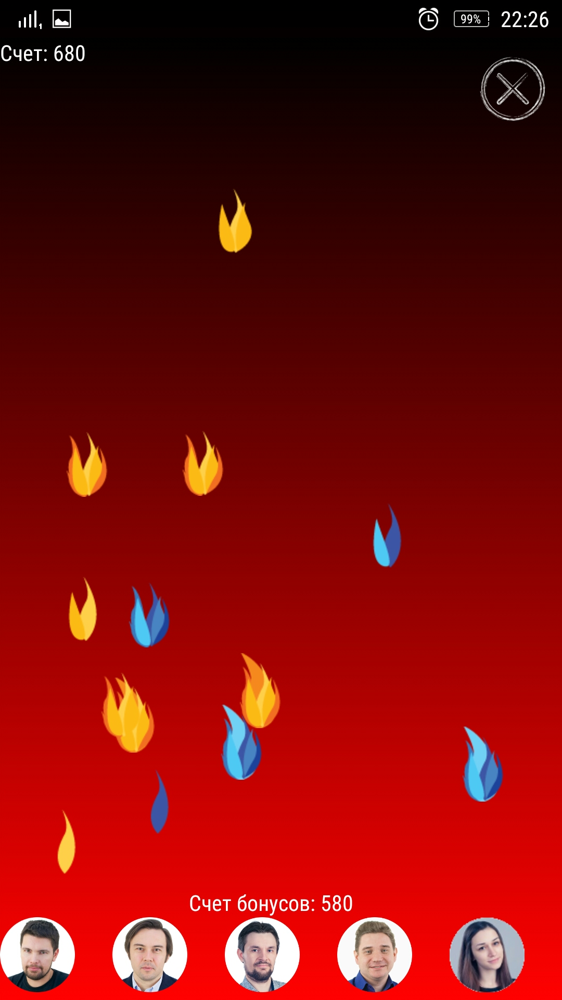
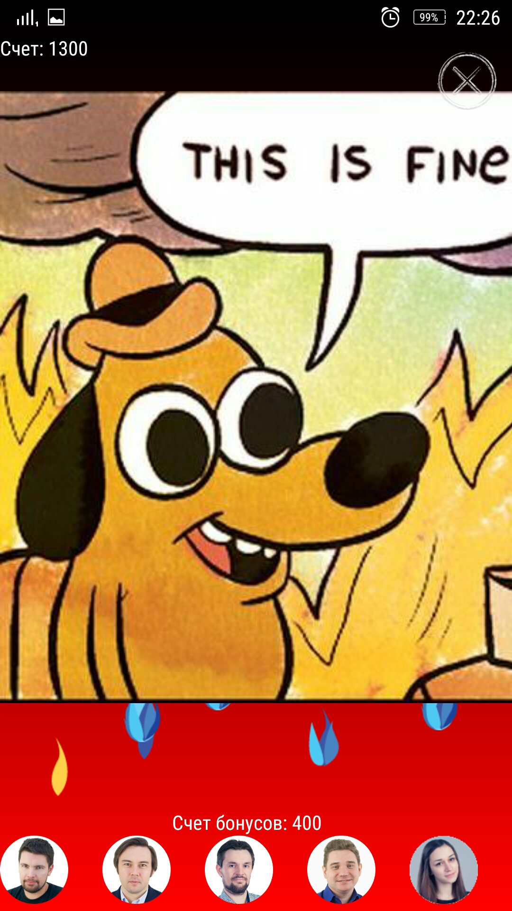

# FireELMAn

FireELMAn game

Движок: [react-native-game-engine](https://github.com/bberak/react-native-game-engine)

    
    
    
    

    

Правила игры:

- Нужно тушить пожары тапами на экран
- При тушении красного огня - дается 10 очков (в общий и бонусный счет)
- При тушении синего огня (появляется после 500 очков) - дается 20 очков (в общий и бонусный счет)
- При тушении зеленого огня вычитается 100 очков из бонусного счета, но если его не тушить, то с некоторой вероятностью он потушится сам и даст 100 дополнительных очков

Бонусы:

- Анатолий Варанкин стоит 50 очков, тушит 3 пожара, добавляет 5 новых и дает 10 очков в общий счет
- Алексей Будин стоит 100 очков, разжигает 10 пожаров, но дает 100 очков в общий счет
- Антон Кононов стоит 150 очков, тушит 3 пожара и добавляет 1 новый
- Александр Пономарев стоит стоит 200 очков, тушит 5 пожаров
- Наталья Самойлова стоит 500 очков, останавливает время появления новых пожаров на 3 секунды

Условие проигрыша: на экране 50 пожаров.

